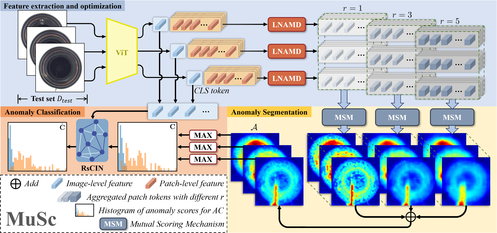
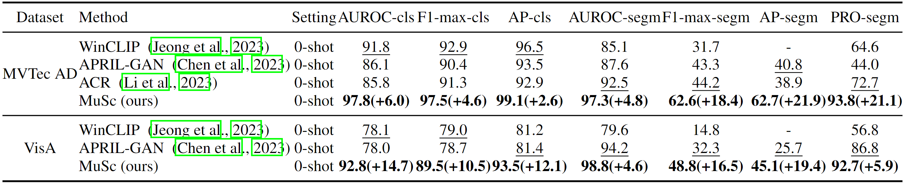
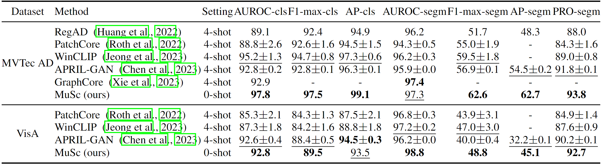

# ✨MuSc (ICLR 2024)✨

**论文“MuSc: Zero-Shot Industrial Anomaly Classification and Segmentation with Mutual Scoring of the Unlabeled Images”的官方复现代码**

作者:  [李煦蕤](https://github.com/xrli-U)<sup>1*</sup> | [黄子鸣](https://github.com/ZimingHuang1)<sup>1*</sup> | [薛峰](https://xuefeng-cvr.github.io/)<sup>3</sup> | [周瑜](https://github.com/zhouyu-hust)<sup>1,2</sup>

单位: <sup>1</sup>华中科技大学 | <sup>2</sup>武汉精测电子集团股份有限公司 | <sup>3</sup>特伦托大学

### 🧐 论文下载地址： [Arxiv](https://arxiv.org/pdf/2401.16753.pdf) | [OpenReview](https://openreview.net/forum?id=AHgc5SMdtd)

## <a href='#all_catelogue'>**转到目录**</a>

## 🙈TODO list:
- ⬜️ 使用一些策略降低每张图的推理速度，从955.3ms降低到**249.8ms**。
- ⬜️ 兼容更多的工业数据集。
- ⬜️ 兼容更多的视觉特征提取器，如 [Vision Mamba](https://github.com/hustvl/Vim)。

## 📣更新日志:
***04/11/2024***
1. 与CVPR 2024中最新的零样本和少样本方法的结果比较添加到了<a href='#compare_sota'>零样本/少样本方法的对比结果</a>中。
2. 修复了`models/backbone/_backbones.py`中的一些bug。

***2024年3月22日***
1. 我们提供了支持[BTAD](https://ieeexplore.ieee.org/abstract/document/9576231)数据集的运行代码，详见`scripts/musc.sh`。
2. 我们修改了代码使其支持更大的*batch_size*。
3. 我们优化了部分代码实现更快的速度。
4. 我们提供了在MVTec AD，VisA和BTAD数据集上，<a href='#results_backbones'>使用不同特征提取器的结果</a>。
5. 我们提供了不同数据集的<a href='#results_datasets'>详细结果</a>。
6. 我们提供了不同特征提取器的<a href='#inference_time'>推理时间</a>。
7. 我们提供了与当前最先进的<a href='#compare_sota'>零样本/少样本方法的对比结果</a>，该表格将会持续更新。
8. 我们汇总了用户在使用MuSc过程中反馈回的<a href='#FAQ'>常见问题</a>，并给出了解答。

***2024年2月1日***

初始版本：

1. 我们提供了[该论文](https://arxiv.org/pdf/2401.16753.pdf)中的**MuSc**方法完整实现代码。
2. 该代码的特征提取器支持[CLIP](https://github.com/mlfoundations/open_clip)、[DINO](https://github.com/facebookresearch/dino)和[DINO_v2](https://github.com/facebookresearch/dinov2)预训练的vision transformer。

<span id='compare_sota'/>

## 🎖️与其它零样本/少样本方法的对比结果 <a href='#all_catelogue'>[转到目录]</a>
我们在下表中展示了我们的MuSc方法与当前最先进的零样本/少样本方法的对比结果，**该表格将持续更新**。
"-"表示作者在原论文中未提供该指标。

### MVTec AD

|                                          |                    |         | Classification |            |        | Segmentation |             |         |          |
| :--------------------------------------: | :----------------: | :-----: | :------------: | :--------: | :----: | :----------: | :---------: | :-----: | :------: |
|                 Methods                  |       Venue        | Setting |   AUROC-cls    | F1-max-cls | AP-cls |  AUROC-segm  | F1-max-segm | AP-segm | PRO-segm |
|                MuSc(ours)                |     ICLR 2024      | 0-shot  |      97.8      |    97.5    |  99.1  |     97.3     |    62.6     |  62.7   |   93.8   |
| [RegAD](https://link.springer.com/chapter/10.1007/978-3-031-20053-3_18) |     ECCV 2022      | 4-shot  |      89.1      |    92.4    |  94.9  |     96.2     |    51.7     |  48.3   |   88.0   |
| [GraphCore](https://openreview.net/forum?id=xzmqxHdZAwO) |     ICLR 2023      | 4-shot  |      92.9      |     -      |   -    |     97.4     |      -      |    -    |    -     |
| [WinCLIP](https://openaccess.thecvf.com/content/CVPR2023/papers/Jeong_WinCLIP_Zero-Few-Shot_Anomaly_Classification_and_Segmentation_CVPR_2023_paper.pdf) |     CVPR 2023      | 0-shot  |      91.8      |    92.9    |  96.5  |     85.1     |    31.7     |    -    |   64.6   |
| [WinCLIP](https://openaccess.thecvf.com/content/CVPR2023/papers/Jeong_WinCLIP_Zero-Few-Shot_Anomaly_Classification_and_Segmentation_CVPR_2023_paper.pdf) |     CVPR 2023      | 4-shot  |      95.2      |    94.7    |  97.3  |     96.2     |    51.7     |    -    |   88.0   |
| [APRIL-GAN](https://arxiv.org/pdf/2305.17382.pdf) | CVPR Workshop 2023 | 0-shot  |      86.1      |    90.4    |  93.5  |     87.6     |    43.3     |  40.8   |   44.0   |
| [APRIL-GAN](https://arxiv.org/pdf/2305.17382.pdf) | CVPR Workshop 2023 | 4-shot  |      92.8      |    92.8    |  96.3  |     95.9     |    56.9     |  54.5   |   91.8   |
| [FastRecon](https://openaccess.thecvf.com/content/ICCV2023/papers/Fang_FastRecon_Few-shot_Industrial_Anomaly_Detection_via_Fast_Feature_Reconstruction_ICCV_2023_paper.pdf) |     ICCV 2023      | 4-shot  |      94.2      |     -      |   -    |     97.0     |      -      |    -    |    -     |
| [ACR](https://proceedings.neurips.cc/paper_files/paper/2023/file/8078e8c3055303a884ffae2d3ea00338-Paper-Conference.pdf) |    NeurIPS 2023    | 0-shot  |      85.8      |    91.3    |  92.9  |     92.5     |    44.2     |  38.9   |   72.7   |
| [RegAD+Adversarial Loss](https://papers.bmvc2023.org/0202.pdf) |     BMVC 2023      | 8-shot  |      91.9      |     -      |   -    |     96.9     |      -      |    -    |    -     |
| [PACKD](https://papers.bmvc2023.org/0259.pdf) |     BMVC 2023      | 8-shot  |      95.3      |     -      |   -    |     97.3     |      -      |    -    |    -     |
| [PromptAD](https://openaccess.thecvf.com/content/WACV2024/papers/Li_PromptAD_Zero-Shot_Anomaly_Detection_Using_Text_Prompts_WACV_2024_paper.pdf) |     WACV 2024      | 0-shot  |      90.8      |     -      |   -    |     92.1     |    36.2     |    -    |   72.8   |
| [AnomalyCLIP](https://openreview.net/forum?id=buC4E91xZE) |     ICLR 2024      | 0-shot  |      91.5      |     -      |  96.2  |     91.1     |      -      |    -    |   81.4   |
| [InCTRL](https://arxiv.org/pdf/2403.06495.pdf) |     CVPR 2024      | 8-shot  |      95.3      |     -      |   -    |      -       |      -      |    -    |    -     |
| [MVFA-AD](https://arxiv.org/pdf/2403.12570.pdf) |     CVPR 2024      | 4-shot  |      96.2      |     -      |   -    |     96.3     |
| [PromptAD](https://arxiv.org/pdf/2404.05231.pdf) |     CVPR 2024      | 4-shot  |      96.6      |     -      |   -    |     96.5     |      -      |    -    |    -     |

### VisA

|                                          |                    |         | Classification |            |        | Segmentation |             |         |          |
| :--------------------------------------: | :----------------: | :-----: | :------------: | :--------: | :----: | :----------: | :---------: | :-----: | :------: |
|                 Methods                  |       Venue        | Setting |   AUROC-cls    | F1-max-cls | AP-cls |  AUROC-segm  | F1-max-segm | AP-segm | PRO-segm |
|                MuSc(ours)                |     ICLR 2024      | 0-shot  |      92.8      |    89.5    |  93.5  |     98.8     |    48.8     |  45.1   |   92.7   |
| [WinCLIP](https://openaccess.thecvf.com/content/CVPR2023/papers/Jeong_WinCLIP_Zero-Few-Shot_Anomaly_Classification_and_Segmentation_CVPR_2023_paper.pdf) |     CVPR 2023      | 0-shot  |      78.1      |    79.0    |  81.2  |     79.6     |    14.8     |    -    |   56.8   |
| [WinCLIP](https://openaccess.thecvf.com/content/CVPR2023/papers/Jeong_WinCLIP_Zero-Few-Shot_Anomaly_Classification_and_Segmentation_CVPR_2023_paper.pdf) |     CVPR 2023      | 4-shot  |      87.3      |    84.2    |  88.8  |     97.2     |    47.0     |    -    |   87.6   |
| [APRIL-GAN](https://arxiv.org/pdf/2305.17382.pdf) | CVPR Workshop 2023 | 0-shot  |      78.0      |    78.7    |  81.4  |     94.2     |    32.3     |  25.7   |   86.8   |
| [APRIL-GAN](https://arxiv.org/pdf/2305.17382.pdf) | CVPR Workshop 2023 | 4-shot  |      92.6      |    88.4    |  94.5  |     96.2     |    40.0     |  32.2   |   90.2   |
| [PACKD](https://papers.bmvc2023.org/0259.pdf) |     BMVC 2023      | 8-shot  |      87.5      |     -      |   -    |     97.9     |      -      |    -    |    -     |
| [AnomalyCLIP](https://openreview.net/forum?id=buC4E91xZE) |     ICLR 2024      | 0-shot  |      82.1      |     -      |  85.4  |     95.5     |      -      |    -    |   87.0   |
| [InCTRL](https://arxiv.org/pdf/2403.06495.pdf) |     CVPR 2024      | 8-shot  |      88.7      |     -      |   -    |      -       |      -      |    -    |    -     |
| [PromptAD](https://arxiv.org/pdf/2404.05231.pdf) |     CVPR 2024      | 4-shot  |      89.1      |     -      |   -    |     97.4     |      -      |    -    |    -     |

<span id='all_catelogue'/>

## 📖目录

* <a href='#abstract'>1. 论文介绍</a>
* <a href='#setup'>2. 代码运行环境配置</a>
* <a href='#datasets'>3. 数据集下载</a>
  * <a href='#datatets_mvtec_ad'>MVTec AD</a>
  * <a href='#datatets_visa'>VisA</a>
  * <a href='#datatets_btad'>BTAD</a>
* <a href='#run_musc'>4. 运行代码</a>
* <a href='#rscin'>5. 单独运行RsCIN分类优化模块</a>
* <a href='#results_datasets'>6. 在不同数据上的结果</a>
* <a href='#results_backbones'>7. 使用不同特征提取器的结果</a>
* <a href='#inference_time'>8. 推理时间</a>
* <a href='#FAQ'>9. 常见问题</a>
* <a href='#citation'>10. 引用格式</a>
* <a href='#thanks'>11. 致谢</a>
* <a href='#license'>12. 使用许可</a>

<span id='abstract'/>

## 👇论文介绍: <a href='#all_catelogue'>[返回目录]</a>

该论文研究了工业视觉领域中的零样本异常检测和分割任务。
零样本，即不使用任何与测试图像同源的有标注图像，以往的方法基于CLIP的图文对齐能力和SAM的提示工程，忽略了无标签测试图像本身蕴含的丰富正常先验信息。
本论文的关键发现在于工业产品图像中，图像的正常区域可以在其他无标注的图像中找到相对大量的相似的正常区域，而异常区域只能找到少量相似的区域。
我们利用这种特性设计了一种新的零样本异常检测/分割方法MuSc，该方法的核心在于对无标注的图像进行相互打分，正常区域会被赋予较低的分数，异常区域会被赋予较高的分数。
该方法不需要任何辅助数据集进行训练，也不需要额外的文本模态进行提示。

具体而言，我们首先使用多聚合度邻域聚合模块(**LNAMD**)来获取能够表征不同大小缺陷的区域级特征。
然后我们提出了互打分模块(**MSM**)，使用无标注图像进行相互打分，分数越高表示该图像区域异常概率越大。
最后，我们提出了一个分类优化模块，名为图像级受限邻域的重打分(**RsCIN**)，来优化分类结果，减少噪声带来的误检。

我们通过在MVTec AD和VisA数据集上的优异性能证明了我们方法的有效性，与当前SOTA零样本异常检测方法相比，MuSc在MVTec AD数据集上实现了**21.1**%的PRO提升(从72.7％到93.8％)，在VisA上实现了**19.4**%的AP分割提升和**14.7**%的AUROC分割提升。
此外，我们的零样本方法甚至优于当前大多数少样本方法，并且与一些无监督方法相媲美。

 

## 😊与其它零样本异常检测方法比较

 

## 😊与其它少样本异常检测方法比较

 

<span id='setup'/>

## 🎯代码环境配置: <a href='#all_catelogue'>[返回目录]</a>

### 环境:

- Python 3.8
- CUDA 11.7
- PyTorch 2.0.1

使用如下命令克隆该项目到本地:

```
git clone https://github.com/xrli-U/MuSc.git
```

创建虚拟环境:

```
conda create --name musc python=3.8
conda activate musc
```

安装依赖库:

```
pip install torch==2.0.1 torchvision==0.15.2 torchaudio==2.0.2
pip install -r requirements.txt
```

<span id='datasets'/>

## 👇数据集下载: <a href='#all_catelogue'>[返回目录]</a>

把所有的数据集放在`./data`文件夹下。

<span id='datatets_mvtec_ad'/>

### [MVTec AD](https://www.mvtec.com/company/research/datasets/mvtec-ad/)

```
data
|---mvtec_anomaly_detection
|-----|-- bottle
|-----|-----|----- ground_truth
|-----|-----|----- test
|-----|-----|----- train
|-----|-- cable
|-----|--- ...
```

<span id='datatets_visa'/>

### [VisA](https://amazon-visual-anomaly.s3.us-west-2.amazonaws.com/VisA_20220922.tar)

```
data
|----visa
|-----|-- split_csv
|-----|-----|--- 1cls.csv
|-----|-----|--- ...
|-----|-- candle
|-----|-----|--- Data
|-----|-----|-----|----- Images
|-----|-----|-----|--------|------ Anomaly 
|-----|-----|-----|--------|------ Normal 
|-----|-----|-----|----- Masks
|-----|-----|-----|--------|------ Anomaly 
|-----|-----|--- image_anno.csv
|-----|-- capsules
|-----|--- ...
```

VisA dataset需要使用如下程序划分训练集和测试集。

```
python ./datasets/visa_preprocess.py
```

<span id='datatets_btad'/>

### [BTAD](https://github.com/pankajmishra000/VT-ADL)

```
data
|---btad
|-----|--- 01
|-----|-----|----- ground_truth
|-----|-----|----- test
|-----|-----|----- train
|-----|--- 02
|-----|--- ...
```

<span id='run_musc'/>

## 💎运行主程序: <a href='#all_catelogue'>[返回目录]</a>

我们提供了两种方式运行我们的代码。

### python运行

```
python examples/musc_main.py
```
遵循`./configs/musc.yaml`中的设置。

### shell运行

```
sh scripts/musc.sh
```
脚本`musc.sh`中的设置具有更高的优先级。

关键参数如下：

- `--device`: GPU_id。
- `--data_path`: 数据集路径。
- `--dataset_name`: 数据集名称。
- `--class_name`: 进行测试的类别，如果该参数设置为`ALL`，将对所有的类别进行测试。
- `--backbone_name`: 特征提取器的名称，我们的代码兼容CLIP，DINO和DINO_v2，详见`configs/musc.yaml`。
- `--pretrained`: 选择预训练的CLIP模型，可选`openai`，`laion400m_e31`和`laion400m_e32`。
- `--feature_layers`: backbone中用于提取特征的层。
- `--img_resize`: 输入到模型中的图像大小。
- `--divide_num`: 将完整的无标签测试集划分为子集的数量。
- `--r_list`: LNAMD模块中的多个聚合度。
- `--output_dir`: 保存该方法预测的异常概率图和检测分割指标的路径。
- `--vis`: 是否保存该方法预测的异常概率图。
- `--vis_type`: 可在`single_norm`和`whole_norm`中进行选择，`single_norm`意思是将每张异常概率图进行归一化后再可视化，`whole_norm`意思是将全部异常概率图统一进行归一化后再可视化。
- `--save_excel`: 是否保存该方法异常检测和分割的指标。

<span id='rscin'/>

## 💎分类优化模块RsCIN: <a href='#all_catelogue'>[返回目录]</a>

对于我们的RsCIN模块，我们在`./models/RsCIN_features`文件夹中提供了额外的代码方便实现迁移。
我们使用*ViT-large-14-336 of CLIP*提取了MVTec AD和VisA数据集的图像级特征，并分别存储在`mvtec_ad_cls.dat`和`visa_cls.dat`中，
在`./models/RsCIN_features/RsCIN.py`文件中我们展示了如何使用它们。

### 使用样例
在使用我们的RsCIN模块之前，请将`RsCIN.py`、`mvtec_ad_cls.dat`和`visa_cls.dat`移动到自己的项目目录下。

```
import numpy as np
from RsCIN import Mobile_RsCIN

classification_results = np.random.rand(83) # 优化前的分类结果
dataset_name = 'mvtec_ad' # 数据集名称
class_name = 'bottle' # 数据集中的产品类别
optimized_classification_results = Mobile_RsCIN(classification_results, dataset_name=dataset_name, class_name=class_name)
```

`optimized_classification_results`表示经过我们的RsCIN模块优化之后的分类结果。

### Apply to the custom dataset

如下，对于其它自定义的数据集，您可以提取每张图像的图像级特征，并存储在变量`cls_tokens`中，多窗口掩膜操作中的多个窗口大小可以通过改变变量`k_list`的值进行调整。

```
import numpy as np
from RsCIN import Mobile_RsCIN

classification_results = np.random.rand(83) # the 优化前的分类结果
cls_tokens = np.random.rand(83, 768)  # shape[N, C] 图像级特征, N为图像的数量
k_list = [2, 3] # 多窗口掩膜操作中的多个窗口大小
optimized_classification_results = Mobile_RsCIN(classification_results, k_list=k_list, cls_tokens=cls_tokens)
```

<span id='results_datasets'/>

## 🎖️不同数据集的结果: <a href='#all_catelogue'>[返回目录]</a>

以下所有的结果均按照论文中的默认设置复现。

### MVTec AD

|            | Classification |            |        | Segmentation |             |         |          |
| :--------: | :------------: | :--------: | :----: | :----------: | :---------: | :-----: | :------: |
|  Category  |   AUROC-cls    | F1-max-cls | AP-cls |  AUROC-segm  | F1-max-segm | AP-segm | PRO-segm |
|   bottle   |     99.92      |   99.21    | 99.98  |    98.48     |    79.17    |  83.04  |  96.10   |
|   cable    |     98.99      |   97.30    | 99.42  |    95.76     |    60.97    |  57.70  |  89.62   |
|  capsule   |     96.45      |   94.88    | 99.30  |    98.96     |    49.80    |  48.45  |  95.49   |
|   carpet   |     99.88      |   99.44    | 99.96  |    99.45     |    73.33    |  76.05  |  97.58   |
|    grid    |     98.66      |   96.49    | 99.54  |    98.16     |    43.94    |  38.24  |  93.92   |
|  hazelnut  |     99.61      |   98.55    | 99.79  |    99.38     |    73.41    |  73.28  |  92.24   |
|  leather   |     100.0      |   100.0    | 100.0  |    99.72     |    62.84    |  64.47  |  98.74   |
| metal_nut  |     96.92      |   97.38    | 99.25  |    86.12     |    46.22    |  47.54  |  89.34   |
|    pill    |     96.24      |   95.89    | 99.31  |    97.47     |    65.54    |  67.25  |  98.01   |
|   screw    |     82.17      |   88.89    | 90.88  |    98.77     |    41.87    |  36.12  |  94.40   |
|    tile    |     100.0      |   100.0    | 100.0  |    97.90     |    74.71    |  78.90  |  94.64   |
| toothbrush |     100.0      |   100.0    | 100.0  |    99.53     |    70.19    |  67.79  |  95.48   |
| transistor |     99.42      |   95.00    | 99.19  |    91.38     |    59.24    |  58.40  |  77.21   |
|    wood    |     98.51      |   98.33    | 99.52  |    97.24     |    68.64    |  74.75  |  94.50   |
|   zipper   |     99.84      |   99.17    | 99.96  |    98.40     |    62.48    |  61.89  |  94.46   |
|    mean    |     97.77      |   97.37    | 99.07  |    97.11     |    62.16    |  62.26  |  93.45   |

### VisA

|            | Classification |            |        | Segmentation |             |         |          |
| :--------: | :------------: | :--------: | :----: | :----------: | :---------: | :-----: | :------: |
|  Category  |   AUROC-cls    | F1-max-cls | AP-cls |  AUROC-segm  | F1-max-segm | AP-segm | PRO-segm |
|   candle   |     96.55      |   91.26    | 96.45  |    99.36     |    39.56    |  28.36  |  97.62   |
|  capsules  |     88.62      |   86.43    | 93.77  |    98.71     |    50.85    |  43.90  |  88.20   |
|   cashew   |     98.54      |   95.57    | 99.30  |    99.33     |    74.88    |  77.63  |  94.30   |
| chewinggum |     98.42      |   96.45    | 99.30  |    99.54     |    61.33    |  61.21  |  88.39   |
|   fryum    |     98.64      |   97.44    | 99.43  |    99.43     |    58.13    |  50.43  |  94.38   |
| macaroni1  |     89.33      |   82.76    | 88.64  |    99.51     |    21.90    |  15.25  |  96.37   |
| macaroni2  |     68.03      |   69.96    | 67.37  |    97.14     |    11.06    |  3.91   |  88.84   |
|    pcb1    |     89.28      |   84.36    | 89.89  |    99.50     |    80.49    |  88.36  |  92.76   |
|    pcb2    |     93.20      |   88.66    | 94.46  |    97.39     |    34.38    |  21.86  |  86.06   |
|    pcb3    |     93.52      |   86.92    | 93.48  |    98.05     |    40.23    |  41.03  |  92.32   |
|    pcb4    |     98.43      |   92.89    | 98.47  |    98.70     |    46.38    |  44.72  |  92.66   |
| pipe_fryum |     98.34      |   96.04    | 99.16  |    99.40     |    48.90    |  67.90  |  97.32   |
|    mean    |     92.57      |   89.06    | 93.31  |    98.71     |    67.56    |  45.38  |  92.43   |

### BTAD

|          | Classification |            |        | Segmentation |             |         |          |
| :------: | :------------: | :--------: | :----: | :----------: | :---------: | :-----: | :------: |
| Category |   AUROC-cls    | F1-max-cls | AP-cls |  AUROC-segm  | F1-max-segm | AP-segm | PRO-segm |
|    01    |     98.74      |   97.96    | 99.53  |    97.49     |    59.73    |  58.76  |  85.05   |
|    02    |     90.23      |   95.38    | 98.41  |    95.36     |    58.20    |  55.16  |  68.64   |
|    03    |     99.52      |   88.37    | 95.62  |    99.20     |    55.64    |  57.53  |  96.62   |
|   mean   |     96.16      |   93.90    | 97.85  |    97.35     |    57.86    |  57.15  |  83.43   |

<span id='results_backbones'/>

## 🎖️使用不同特征提取器的结果: <a href='#all_catelogue'>[返回目录]</a>

我们论文中使用的默认特征提取器是CLIP的ViT-large-14-336。
我们还提供了CLIP、DINO和DINO_v2的vision transformer作为特征提取器的运行程序，具体信息详见`configs/musc.yaml`。

### MVTec AD

|                   |              |            | Classification |            |        | Segmentation |             |         |          |
| :---------------: | :----------: | :--------: | :------------: | :--------: | :----: | :----------: | :---------: | :-----: | :------: |
|     Backbones     | Pre-training | image size |   AUROC-cls    | F1-max-cls | AP-cls |  AUROC-segm  | F1-max-segm | AP-segm | PRO-segm |
|     ViT-B-32      |     CLIP     |    256     |     87.99      |   92.31    | 94.38  |    93.08     |    42.06    |  37.21  |  72.62   |
|     ViT-B-32      |     CLIP     |    512     |     89.91      |   92.72    | 95.12  |    95.73     |    53.32    |  52.33  |  83.72   |
|     ViT-B-16      |     CLIP     |    256     |     92.78      |   93.98    | 96.59  |    96.21     |    52.48    |  50.23  |  87.00   |
|     ViT-B-16      |     CLIP     |    512     |     94.20      |   95.20    | 97.34  |    97.09     |    61.24    |  61.45  |  91.67   |
| ViT-B-16-plus-240 |     CLIP     |    240     |     94.77      |   95.43    | 97.60  |    96.26     |    52.23    |  50.27  |  87.70   |
| ViT-B-16-plus-240 |     CLIP     |    512     |     95.69      |   96.50    | 98.11  |    97.28     |    60.71    |  61.29  |  92.14   |
|     ViT-L-14      |     CLIP     |    336     |     96.06      |   96.65    | 98.25  |    97.24     |    59.41    |  58.10  |  91.69   |
|     ViT-L-14      |     CLIP     |    518     |     95.94      |   96.32    | 98.30  |    97.42     |    63.06    |  63.67  |  92.92   |
|   ViT-L-14-336    |     CLIP     |    336     |     96.40      |   96.44    | 98.30  |    97.03     |    57.51    |  55.44  |  92.18   |
|   ViT-L-14-336    |     CLIP     |    518     |     97.77      |   97.37    | 99.07  |    97.11     |    62.16    |  62.26  |  93.45   |
|  dino_vitbase16   |     DINO     |    256     |     89.39      |   93.77    | 95.37  |    95.83     |    54.02    |  52.84  |  84.24   |
|  dino_vitbase16   |     DINO     |    512     |     94.11      |   96.13    | 97.26  |    97.78     |    62.07    |  63.20  |  92.49   |
|   dinov2_vitb14   |   DINO_v2    |    336     |     95.67      |   96.80    | 97.95  |    97.74     |    60.23    |  59.45  |  93.84   |
|   dinov2_vitb14   |   DINO_v2    |    518     |     96.31      |   96.87    | 98.32  |    98.07     |    64.65    |  65.31  |  95.59   |
|   dinov2_vitl14   |   DINO_v2    |    336     |     96.84      |   97.45    | 98.68  |    98.17     |    61.77    |  61.21  |  94.62   |
|   dinov2_vitl14   |   DINO_v2    |    518     |     97.08      |   97.13    | 98.82  |    98.34     |    66.15    |  67.39  |  96.16   |


### VisA

|                   |              |            | Classification |            |        | Segmentation |             |         |          |
| :---------------: | :----------: | :--------: | :------------: | :--------: | :----: | :----------: | :---------: | :-----: | :------: |
|     Backbones     | Pre-training | image size |   AUROC-cls    | F1-max-cls | AP-cls |  AUROC-segm  | F1-max-segm | AP-segm | PRO-segm |
|     ViT-B-32      |     CLIP     |    256     |     72.95      |   76.90    | 77.68  |    89.30     |    25.93    |  20.68  |  50.95   |
|     ViT-B-32      |     CLIP     |    512     |     77.82      |   80.20    | 81.01  |    96.06     |    34.72    |  30.20  |  73.08   |
|     ViT-B-16      |     CLIP     |    256     |     81.44      |   80.86    | 83.84  |    95.97     |    36.72    |  31.81  |  73.48   |
|     ViT-B-16      |     CLIP     |    512     |     86.48      |   84.12    | 88.05  |    97.98     |    42.21    |  37.29  |  85.10   |
| ViT-B-16-plus-240 |     CLIP     |    240     |     82.62      |   81.61    | 85.05  |    96.11     |    37.84    |  33.43  |  72.37   |
| ViT-B-16-plus-240 |     CLIP     |    512     |     86.72      |   84.22    | 89.41  |    97.95     |    43.27    |  37.68  |  83.52   |
|     ViT-L-14      |     CLIP     |    336     |     88.38      |   85.23    | 89.77  |    98.32     |    44.67    |  40.42  |  87.80   |
|     ViT-L-14      |     CLIP     |    518     |     90.86      |   87.75    | 91.66  |    98.45     |    45.74    |  42.09  |  89.93   |
|   ViT-L-14-336    |     CLIP     |    336     |     88.61      |   85.31    | 90.00  |    98.53     |    45.10    |  40.92  |  89.35   |
|   ViT-L-14-336    |     CLIP     |    518     |     92.57      |   89.06    | 93.31  |    98.71     |    48.90    |  45.38  |  92.43   |
|  dino_vitbase16   |     DINO     |    256     |     78.21      |   80.12    | 81.11  |    95.74     |    36.81    |  32.84  |  70.21   |
|  dino_vitbase16   |     DINO     |    512     |     84.11      |   83.52    | 85.91  |    97.74     |    42.86    |  38.27  |  83.00   |
|   dinov2_vitb14   |   DINO_v2    |    336     |     87.65      |   86.24    | 88.51  |    97.80     |    41.68    |  37.06  |  85.01   |
|   dinov2_vitb14   |   DINO_v2    |    518     |     90.25      |   87.48    | 90.86  |    98.66     |    45.56    |  41.23  |  91.80   |
|   dinov2_vitl14   |   DINO_v2    |    336     |     90.18      |   88.47    | 90.56  |    98.38     |    43.84    |  38.74  |  88.38   |
|   dinov2_vitl14   |   DINO_v2    |    518     |     91.73      |   89.20    | 92.27  |    98.78     |    47.12    |  42.79  |  92.40   |


### BTAD

|                   |              |            | Classification |            |        | Segmentation |             |         |          |
| :---------------: | :----------: | :--------: | :------------: | :--------: | :----: | :----------: | :---------: | :-----: | :------: |
|     Backbones     | Pre-training | image size |   AUROC-cls    | F1-max-cls | AP-cls |  AUROC-segm  | F1-max-segm | AP-segm | PRO-segm |
|     ViT-B-32      |     CLIP     |    256     |     92.19      |   95.55    | 98.47  |    96.74     |    43.98    |  35.70  |  68.56   |
|     ViT-B-32      |     CLIP     |    512     |     93.31      |   94.61    | 98.40  |    97.41     |    52.94    |  48.80  |  69.59   |
|     ViT-B-16      |     CLIP     |    256     |     92.44      |   91.00    | 97.31  |    97.45     |    55.27    |  52.19  |  72.68   |
|     ViT-B-16      |     CLIP     |    512     |     94.11      |   92.99    | 97.98  |    97.91     |    59.18    |  59.05  |  77.86   |
| ViT-B-16-plus-240 |     CLIP     |    240     |     92.86      |   93.99    | 97.96  |    97.68     |    54.81    |  51.33  |  73.47   |
| ViT-B-16-plus-240 |     CLIP     |    512     |     94.13      |   93.84    | 98.34  |    98.14     |    58.66    |  57.53  |  77.23   |
|     ViT-L-14      |     CLIP     |    336     |     92.74      |   93.21    | 97.71  |    97.84     |    56.60    |  55.94  |  77.01   |
|     ViT-L-14      |     CLIP     |    518     |     94.82      |   95.29    | 98.58  |    97.77     |    55.55    |  55.46  |  80.62   |
|   ViT-L-14-336    |     CLIP     |    336     |     95.11      |   94.48    | 98.53  |    97.42     |    56.75    |  55.23  |  79.63   |
|   ViT-L-14-336    |     CLIP     |    518     |     96.16      |   93.90    | 97.85  |    97.35     |    57.86    |  57.15  |  83.43   |
|  dino_vitbase16   |     DINO     |    256     |     93.63      |   95.66    | 98.66  |    97.55     |    52.16    |  49.25  |  72.86   |
|  dino_vitbase16   |     DINO     |    512     |     92.38      |   92.66    | 97.81  |    97.44     |    53.32    |  53.02  |  74.91   |
|   dinov2_vitb14   |   DINO_v2    |    336     |     93.60      |   91.65    | 97.19  |    98.08     |    63.28    |  65.32  |  74.35   |
|   dinov2_vitb14   |   DINO_v2    |    518     |     94.99      |   95.11    | 98.55  |    98.30     |    65.75    |  68.89  |  80.41   |
|   dinov2_vitl14   |   DINO_v2    |    336     |     94.15      |   92.64    | 97.61  |    98.19     |    63.86    |  66.03  |  76.33   |
|   dinov2_vitl14   |   DINO_v2    |    518     |     95.62      |   95.40    | 98.76  |    98.40     |    65.88    |  69.90  |  82.47   |

<span id='inference_time'/>

## ⌛推理时间: <a href='#all_catelogue'>[返回目录]</a>

在下表中，我们展示了使用不用backbone和image size时的推理速度。
在计算推理速度时，我们设定一次性参与互打分的图像数量为**200**，所用GPU为单卡NVIDIA RTX 3090。

|                   |              |            |                 |
| :---------------: | :----------: | :--------: | :-------------: |
|     Backbones     | Pre-training | image size | times(ms/image) |
|     ViT-B-32      |     CLIP     |    256     |      48.33      |
|     ViT-B-32      |     CLIP     |    512     |      95.74      |
|     ViT-B-16      |     CLIP     |    256     |      86.68      |
|     ViT-B-16      |     CLIP     |    512     |      450.5      |
| ViT-B-16-plus-240 |     CLIP     |    240     |      85.25      |
| ViT-B-16-plus-240 |     CLIP     |    512     |      506.4      |
|     ViT-L-14      |     CLIP     |    336     |      266.0      |
|     ViT-L-14      |     CLIP     |    518     |      933.3      |
|   ViT-L-14-336    |     CLIP     |    336     |      270.2      |
|   ViT-L-14-336    |     CLIP     |    518     |      955.3      |
|  dino_vitbase16   |     DINO     |    256     |      85.97      |
|  dino_vitbase16   |     DINO     |    512     |      458.5      |
|   dinov2_vitb14   |   DINO_v2    |    336     |      209.1      |
|   dinov2_vitb14   |   DINO_v2    |    518     |      755.0      |
|   dinov2_vitl14   |   DINO_v2    |    336     |      281.4      |
|   dinov2_vitl14   |   DINO_v2    |    518     |     1015.1      |

<span id='FAQ'/>

## 🙋🙋‍♂️常见问题: <a href='#all_catelogue'>[返回目录]</a>

Q: 可视化图中正常的图像上为什么会出现大面积较高的异常分数？

A: 在可视化时，为了突出异常区域，我们默认采用了单图归一化，即便单图响应整体较低，经过归一化后也会出现大量的高亮区域。可通过在shell脚本中添加`vis_type`参数，并设置为`whole_norm`来进行全部图像一同归一化，也可通过修改`./configs/musc.yaml`配置文件中的`testing->vis_type`参数来实现相同的效果。

Q: 输入到模型中的图像分辨率如何选取？

A: 输入到模型中的图像分辨率`img_resize`一般为ViT patch size的倍数，可以防止边缘部分产生误检，常用的值为224、240、256、336、512、518，我们在上一节<a href='#results_backbones'>*(跳转)*</a>中展示了不同特征提取器常用的两种输入图像分辨率的大小，可供参考。
可通过修改shell脚本中的`img_resize`参数更改图像分辨率，也可通过修改`./configs/musc.yaml`配置文件中的`datasets->img_resize`参数来更改。


<span id='citation'/>

## 引用: <a href='#all_catelogue'>[返回目录]</a>
```
@inproceedings{Li2024MuSc,
  title={MuSc: Zero-Shot Industrial Anomaly Classification and Segmentation with Mutual Scoring of the Unlabeled Images},
  author={Li, Xurui and Huang, Ziming and Xue, Feng and Zhou, Yu},
  booktitle={International Conference on Learning Representations},
  year={2024}
}
```

<span id='thanks'/>

## 致谢: <a href='#all_catelogue'>[返回目录]</a>

Our repo is built on [PatchCore](https://github.com/amazon-science/patchcore-inspection) and [APRIL-GAN](https://github.com/ByChelsea/VAND-APRIL-GAN), thanks their clear and elegant code !

<span id='license'/>

## 使用许可: <a href='#all_catelogue'>[返回目录]</a>
MuSc is released under the **MIT Licence**, and is fully open for academic research and also allow free commercial usage. To apply for a commercial license, please contact yuzhou@hust.edu.cn.
